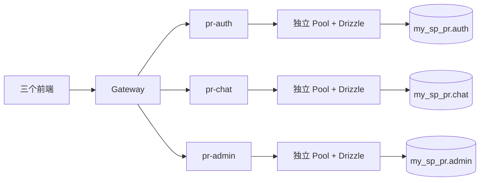

# PostgreSQL 18 + Drizzle 数据库基础设施接入方案

日期：2026-09-22  
状态：已完成实施与验收。用户授权后将数据库环境调整为 Neon 云端 PostgreSQL 18；以下云端适配决定优先于原本地环境描述。实际结果见 [验收记录](20260922-pg18-drizzle-verification.md)。

## 云端实施适配

- 使用用户提供的现有测试数据库；保留 Neon 管理的数据库所有者，不新建或接管项目数据库。
- 由 SQL 创建六个专用角色，保留 auth/chat/admin Schema、权限和迁移隔离；不让 HTTP 服务使用 Neon 所有者账号。
- Neon 的 `-pooler` 地址为事务池；初始化时仅对 Neon 官方域名将其转换为同端点直连地址。运行时使用直连加应用 Pool，迁移使用直连独占连接，以支持会话超时、搜索路径和 advisory lock。
- 支持 Neon URL 的 `sslmode=require` 与 `channel_binding=require`；解析后移除 URL 参数并显式设置证书/主机校验与 channel binding，避免 pg 的连接串覆盖 SSL 设置。不关闭证书校验。
- 提供 Node/TypeScript 初始化命令，替代依赖本机 psql 的 bootstrap SQL；管理员凭据及新生成密码仅存于 git 忽略的本地环境文件，权限 0600。
- 管理员操作首先只读检查版本、角色权限与数据库现状；不覆盖现有同名角色或对象。故障验证仍隔离在新建临时数据库中，完成后清理。
- Neon 可能休眠，实际连接延迟将在验证中测量；常规请求仍保持有限超时。
- 实测 Kit 0.31.11 读取已有 snapshot 时会在 out 前添加 `./`，绝对 out 会触发 ENOENT。因此保留 schema 绝对路径，out 改为仓库根相对路径；所有 Kit 命令仍强制 `pnpm -w exec`。
- pg 8.23 的 channel binding 只有协商开关，不支持严格 require。URL 的 prefer/require 启用 `enableChannelBinding`，服务器提供时协商 PLUS；TLS 仍完整校验证书与主机，README 明确说明该限制，不声称已实现强制 channel binding。
- 初始化已验证在现有云端库内事务创建六角色；本地凭据预先以 0600 暂存，提交后重命名。生产部署仍须仅给 HTTP 注入运行凭据。

## 1. 摘要与已确认决策

在已有本机 PostgreSQL 18 中新建项目专用数据库 `my_sp_pr`，三个业务后端分别使用 `auth`、`chat`、`admin` Schema。使用 Drizzle ORM + node-postgres，独立连接池、运行账号、迁移账号和迁移记录；Gateway 保持 HTTP 入口职责。

本次交付数据库连接、配置校验、迁移机制、真实就绪检查、连接关闭流程、开发和部署命令及验证。用户已明确先完成基础设施，不设计用户、登录会话、聊天消息等业务表，不实现账号、登录、权限或聊天功能。

| 决策 | 结果 |
| --- | --- |
| 数据库环境 | 沿用已有本机 PG18，不安装数据库，不新增 Docker Compose |
| 库与账号 | 新建 `my_sp_pr` 和项目专用账号，不复用其他项目的数据 |
| 服务隔离 | 同库分 Schema；各服务只访问自身数据 |
| 启动行为 | 配置或首次数据库检查失败则退出，不开放业务服务监听端口 |
| 运行中故障 | 进程保留，`/ready` 返回 503；数据库恢复后下次检查恢复 200 |
| 迁移时机 | 显式部署步骤，服务启动与热更新均不执行迁移 |
| 目标使用者 | 项目开发者及后续部署维护人员 |

成功标准：三个业务服务在真实 PG18 上独立连接；初始 Schema 与授权可重建；迁移可重复执行且不会串用记录；故障、恢复和退出行为可验证；原健康 API 与前端调用方式兼容。

## 2. 当前状态分析

已读取根 `AGENTS.md`、`README.md`、根及后端包配置、三个业务服务的配置和启动入口、契约源码、生成器、监听器、Gateway 代理及 lint 配置。

- 仓库调查开始时 `git status --short` 为空。
- 当前是 Node.js 24 / pnpm 10.25.0 / TypeScript strict / NodeNext / Express 5。
- `backend/pr-auth`、`backend/pr-chat`、`backend/pr-admin` 只有健康接口，无数据库依赖、业务表或持久化。
- `backend/gateway` 依据契约转发公开接口；所有前端仍必须经 Gateway 调用业务 API。
- 每个后端从应用目录加载 `.env`，进程环境变量优先；现有默认配置不要求数据库。
- 各服务 `src/server.ts` 已处理 SIGINT/SIGTERM，有 10 秒退出期限，目前只关闭 HTTP。
- `ecosystem.config.cjs` 使用四个单实例 fork 进程，尚未设置与应用退出期限匹配的 `kill_timeout`。
- `backend/contracts` 提供编译后的 workspace 包，是新增基础库的包边界参考。
- `scripts/lint-files.mjs` 支持显式文件路径；`eslint.config.mjs` 尚无 CJS 的对应配置。
- 当前无测试框架或 `test` 脚本，验证不依赖虚构的 `pnpm test`。

### 必须随本次接入处理的现有差异

实际契约已拆成 `shared.ts`、`auth.contract.ts`、`chat.contract.ts`、`admin.contract.ts`、`gateway.contract.ts`，`contract.ts` 仅聚合。README/AGENTS 仍描述单文件维护；`scripts/watch-api.ts` 只监听聚合源码，各后端 dev 命令只监听聚合产物。

新增就绪接口会修改拆分文件，因此必须同步修正相关监听范围和文档，否则生成后的子模块变化可能不触发服务重启。

### 尚未验证的环境事实

用户确认已有本机 PG18，但调查没有找到 PATH 中可用的 `psql`/`pg_isready`，常见安装路径亦未定位到实例。本阶段未连接数据库，实际主机、端口、管理员连接方式、账号权限及服务器版本尚未实测。

设计默认开发地址为 `127.0.0.1:5432`；它是可覆盖的配置示例，不表示已验证的连接信息。实施时使用用户本地提供的连接配置验证，不在工具输出或文档中暴露真实密码。

## 3. 架构与数据边界



新增内部技术包 `backend/database`，包名 `@my-sp-pr/database`，复用连接配置、Pool 创建、就绪探测和迁移执行能力。此包不监听端口、不读取默认 `.env`、不持有全局连接、不包含业务表，不依赖 `contracts` 或任何应用。

三个服务在自身包内实例化数据库对象，并维护自己的 Drizzle Schema 和迁移。Gateway、前端、契约包均不依赖数据库包。各进程的池相互独立，即使引用同一技术包也不会共享连接。

后续业务访问链路为 `routes → controllers → services → repositories → Drizzle`。本次没有业务实体，不创建空的 repository/service 模板。事务由业务 service 组织，repository 接受同一事务对象；后续跨服务业务通过服务接口协作，不直接跨 Schema 联表、加外键或写入。

### 3.1 数据库、Schema 与角色

| 业务服务 | 业务 Schema | 运行角色 | 迁移角色 | 迁移记录位置 |
| --- | --- | --- | --- | --- |
| pr-auth | `auth` | `my_sp_pr_auth_app` | `my_sp_pr_auth_migrator` | `auth_migrations.__drizzle_migrations` |
| pr-chat | `chat` | `my_sp_pr_chat_app` | `my_sp_pr_chat_migrator` | `chat_migrations.__drizzle_migrations` |
| pr-admin | `admin` | `my_sp_pr_admin_app` | `my_sp_pr_admin_migrator` | `admin_migrations.__drizzle_migrations` |

三个 `*_migrations` 是工具管理 Schema，不是额外业务域。独立放置可避免业务表的默认 DML 授权让运行账号获得修改迁移记录的权限。

- 运行角色仅有本库 CONNECT、本业务 Schema USAGE，以及本 Schema 内业务表的 SELECT/INSERT/UPDATE/DELETE、序列 USAGE/SELECT；不授予 TRUNCATE、DDL 或其他服务 Schema 的权限。
- 迁移角色拥有自己创建的业务及迁移 Schema，可执行本服务 DDL；拥有本库 CONNECT/CREATE，以便 Drizzle 初始化 Schema，但不是超级用户、库所有者或其他迁移角色成员。CREATE 权限允许创建新命名空间，因此迁移凭据按部署凭据管理，不提供给 HTTP 进程。
- 数据库所有者为专用 NOLOGIN 角色 `my_sp_pr_owner`；由本机管理员完成创建。六个登录角色均无 SUPERUSER/CREATEDB/CREATEROLE/REPLICATION/BYPASSRLS。
- 只在新项目库内撤销 PUBLIC 的 CONNECT/TEMP 及 `public` Schema 的 CREATE/USAGE，再显式授权项目角色；不修改集群配置或其他数据库 ACL。
- 账号名使用项目名前缀，因为 PostgreSQL 角色在集群内共享。
- 业务 Schema 由对应迁移创建并归迁移角色所有；首批授权迁移配置 `ALTER DEFAULT PRIVILEGES`，让以后由该迁移角色创建的表、序列自动具有正确运行权限。
- 不向运行角色授权访问 `*_migrations`；不将迁移 Schema 加入运行角色的搜索路径。
- 连接使用固定的 `pg_catalog,<本服务业务 Schema>` 搜索路径；Drizzle 表通过 `pgSchema(...)` 显式限定名称。Schema 名来自代码，不来自请求参数。
- Schema 划分不等同权限隔离；验收必须使用真实运行账号验证越界访问失败。

### 3.2 初始化边界

新增 `scripts/database-bootstrap.sql`，使用 psql 变量和 `ON_ERROR_STOP`：

1. 检查目标为 PG18，核对 `my_sp_pr` 及上述项目角色是否存在；遇到已有同名对象停止并说明，不自动删除、接管或改密码。
2. 管理员创建 NOLOGIN 所有者、六个专用登录角色和数据库；登录角色密码由操作者本地安全设置，不硬编码默认密码。
3. 切换到新数据库，配置数据库和 public Schema 权限；迁移账号获得 CONNECT/CREATE，运行账号仅获得 CONNECT。
4. 显式执行各服务迁移，由迁移建立业务 Schema 和运行授权。

CREATE DATABASE 不能放入事务；脚本说明部分失败的检查及恢复方法，不宣传整个初始化原子化。该脚本是一次性 provisioning，后续升级只运行服务迁移。不提供自动 reset、drop 或 seed 命令。

## 4. 依赖与包接口

2026-09-22 查询 npm 稳定发布元数据，选用以下精确版本并写入 lockfile：

| 依赖 | 版本 | 安装位置与用途 |
| --- | --- | --- |
| `drizzle-orm` | `0.45.3` | database 包及三个业务服务的运行依赖；连接与本服务 Schema |
| `pg` | `8.23.0` | database 包运行依赖；Node PostgreSQL 驱动 |
| `@types/pg` | `8.23.1` | database 包普通 dependencies，保证公开声明中的 pg 类型可随部署包解析 |
| `drizzle-kit` | `0.31.11` | 根开发依赖；统一执行迁移生成与校验 |
| `zod` | 现有 `4.6.5` | database 包配置校验，沿用当前版本 |

不引入 dotenv、pg-native、新测试框架或第二种 PG 驱动。官方文档部分示例已指向 RC，本方案使用上述稳定组合的实际 API，不照搬 RC 专属配置。

### 4.1 `@my-sp-pr/database` 对外能力

- `parseDatabaseConfig(input, mode)`：校验运行/迁移配置；不连接数据库。输入为环境键值，输出为强类型设置；运行模式不要求迁移 URL，迁移模式不要求 HTTP 配置或运行 URL。
- `createDatabase({ config, schema, namespace, service, expectedRole })`：创建单个 Pool 和类型化 Drizzle 实例，返回 `db`、`checkReady()`、`close()`；不自动连接、迁移或安装进程信号处理器。
- `checkReady()`：获取真实连接并执行只读探测，确认 PG18、连接目标、当前角色符合第 3 节运行角色映射、本服务 Schema 存在且账号具备 USAGE；拒绝超级用户或具有本 Schema CREATE 权限的运行连接。失败抛出可分类错误，连接始终释放；查询超时或连接状态不明时销毁连接。不能只凭池对象存在或上次成功判断就绪。
- `close()`：幂等调用 `pool.end()`，重复退出信号共享同一关闭 Promise。
- `runMigrations({ config, migrationsFolder, migrationsSchema, lockKey, expectedRole })`：校验第 3 节迁移角色映射后使用单独连接执行本服务迁移，最终释放锁并关闭连接；不使用运行 Pool。

公开导出保留泛型推导，不用 `any` 或关闭类型检查来适配 Drizzle。导出类型声明和 ESM JS；服务通过 `workspace:*` 引用 dist，禁止跨包引用 src。

### 4.2 每个服务的数据库入口

- `src/db/schema/index.ts`：本次仅导出对应 `pgSchema('auth'|'chat'|'admin')`，不声明业务表。
- `src/db/index.ts`：按服务配置创建数据库对象并导出，供就绪服务及未来 repository 使用。
- `src/db/migrate.ts`：薄 CLI 入口，从应用目录加载 `.env`，只解析迁移所需配置；以 `import.meta.url` 定位包内 `drizzle/`，兼容 `src/db` 和 `dist/db` 层级。
- `drizzle.config.ts`：纯生成配置，固定 `dialect: 'postgresql'`、本服务 `schemaFilter` 及迁移 Schema/table。所有工具命令通过 `pnpm -w exec` 固定在仓库根目录执行，配置用 `path.resolve('backend/<服务目录>/...')` 得到 schema/out 绝对路径，分别指向 `src/db/schema/index.ts` 和 `drizzle/`；避免依赖 Kit 配置加载器对 `import.meta.url` 的处理，不导入运行时 env 或建立连接。
- `drizzle/`：版本管理中的 SQL 与工具生成的 journal/snapshot。运行包 `files` 增加此目录，生产独立部署能运行迁移。

## 5. 配置、连接池与服务生命周期

三个业务服务各自维护 `.env.example`。沿用应用目录 `.env` 和进程环境优先规则，不提供静默回退到 postgres 管理员、默认账号或内存数据库的行为。

| 环境变量 | 默认/要求 | 用途 |
| --- | --- | --- |
| `DATABASE_URL` | 运行时必填 | 本服务运行账号的连接串 |
| `DATABASE_MIGRATION_URL` | 迁移时必填 | 本服务迁移账号；HTTP 启动不依赖此变量 |
| `DATABASE_SSL_MODE` | 开发 `disable`；生产必须显式设置 | 支持 `disable` / `verify-full` |
| `DATABASE_SSL_CA_FILE` | 可选绝对路径 | verify-full 使用的自定义 CA，未设置则用系统信任链 |
| `DATABASE_POOL_MAX` | `5`，范围 1–20 | 每个进程最大连接数 |
| `DATABASE_CONNECT_TIMEOUT_MS` | `2000` | 建连及池获取等待上限 |
| `DATABASE_STATEMENT_TIMEOUT_MS` | `3000` | 服务端语句超时 |
| `DATABASE_QUERY_TIMEOUT_MS` | `4000` | 驱动等待查询结果上限，必须大于 statement timeout |
| `DATABASE_IDLE_TIMEOUT_MS` | `30000` | 池内空闲连接回收 |

其他固定基线：`lock_timeout=1000ms`、`idle_in_transaction_session_timeout=10000ms`、时区 UTC、`application_name` 使用服务名。迁移连接采用独立的 `statement_timeout=60000ms`、`lock_timeout=5000ms` 和驱动等待 65000ms，不套用业务查询的 3 秒限制。

搜索路径、时区和超时通过 pg 的连接启动参数配置，确保池中每条新连接生效，不依赖不会等待 Promise 的异步 `pool.on('connect')` 回调。角色与 Schema 标识均由固定映射提供。

连接串仅接受 PostgreSQL 协议和明确数据库名；本期不接受 URL query 形式的 SSL/options 参数，以免覆盖独立 TLS 配置。配置报错只输出键名和原因；不输出连接串、密码、完整配置或 SQL 参数。生产 verify-full 校验证书及主机，不使用 `rejectUnauthorized: false`。

连接获取、语句执行和驱动等待均有界；默认池获取加驱动等待约 6 秒，低于 Gateway 8 秒和前端 10 秒。该上限针对单次查询；未来多次查询业务必须另行设计总请求预算。配置校验确保运行连接等待与驱动等待之和不超过 7 秒。

三个单实例业务服务默认最多 15 条运行连接；迁移另占一条/执行进程。未来 PM2 多实例按 `实例数 × pool.max` 重新核算，预留管理及其他应用连接，不直接把池扩大到 PostgreSQL `max_connections`。

### 生命周期

1. 加载、校验本服务配置，构造 Pool/Drizzle，立即注册池后台 `error` 监听和退出信号处理。
2. 执行真实首次探测；确认数据库和本服务 Schema 已初始化后再 `app.listen`。探测失败释放 Pool，非零退出，保留脱敏错误类别。
3. 启动成功日志继续保留。监听失败（如 EADDRINUSE）同样关闭已创建的 Pool，避免端口失败后进程因连接残留而不退出。
4. 运行中池连接异常由 `pool.on('error')` 处理；记录服务、错误类别/SQLSTATE，不打印凭据。失效连接移除，后续检查通过 Pool 新建连接；不无限重试业务写入。
5. SIGINT/SIGTERM 时标记 closing、停止 HTTP 接收并等待在途请求，再等待 `pool.end()`。现有 10 秒总退出计时覆盖 HTTP 和数据库关闭，不能在 HTTP 关闭后提前取消总计时。
6. 信号到达启动探测期间也必须阻止之后开始监听，并关闭池。关闭超时维持现有强制退出行为，所有现有 `console.log` 保留。
7. `ecosystem.config.cjs` 增加 `kill_timeout: 12000`，允许应用完成 10 秒清理；不改变实例数、端口或给 PM2 配置文件写入数据库密码。

## 6. 接口与兼容性

保留现有 `/api/health`、`/api/auth/health`、`/api/chat/health`、`/api/admin/health` 的响应、公开性与消费者；它们仍表示进程存活，不代表数据库可用。

新增下游内部就绪操作：

| 方法与路径 | operationId | 公开性/消费者 |
| --- | --- | --- |
| `GET /api/auth/ready` | `getAuthReadiness` | `internal` / `[]` |
| `GET /api/chat/ready` | `getChatReadiness` | `internal` / `[]` |
| `GET /api/admin/ready` | `getAdminReadiness` | `internal` / `[]` |

200 示例：

```json
{"success":true,"data":{"status":"ready","service":"pr-auth","timestamp":"2026-09-22T00:00:00.000Z","checks":{"database":"ok"}}}
```

数据库连接、超时、Schema/权限未就绪或退出中返回 503：

```json
{"success":false,"error":{"code":"DATABASE_NOT_READY","message":"服务尚未就绪"}}
```

- 在 `shared.ts` 增加就绪响应 Schema、推导类型、`readinessOperation` 和错误码 `DATABASE_NOT_READY`；在各服务契约中登记操作。
- Controller 仅将真实探测失败和退出状态映射为 503；响应 Schema 校验失败等程序错误仍按现有 500 处理，不全部吞成数据库错误。
- 无业务数据和内部连接信息返回给客户端；设置 `Cache-Control: no-store`。
- 三个服务分别增加 readiness route/controller/service，并由现有 routes/index.ts 挂载；路径仍从契约派生。
- Gateway 不代理内部 readiness；经 Gateway 访问这些路径应保持统一 404。运维直接在本机/私网端口探测，前端继续调用原健康接口。
- `pnpm generate:api` 更新下游 OpenAPI 与契约 dist；SDK 不增加 readiness 函数。共享错误码 enum 的变化可能更新 Gateway 文档及三个 SDK 类型，属于本次合理生成影响。
- 不把 Drizzle 表定义、数据库行类型或 ORM 校验适配器导入 API 契约，保持数据库结构与 HTTP 输入输出分别负责各自边界。

## 7. 迁移流程

### 首次迁移

每个服务分别生成：

1. `init_namespace`：从唯一的 `pgSchema(...)` 导出生成业务 Schema 初始化 SQL 和快照，无业务表。
2. `runtime_permissions`：通过 `drizzle-kit generate --custom` 生成迁移容器，填写固定运行角色的 Schema USAGE 和未来业务表/序列默认授权 SQL。

Drizzle 生成 journal/snapshot，不手写它们。自定义授权 SQL 是受版本管理的人工维护迁移。所有迁移在自己的迁移账号下执行，以保证 `ALTER DEFAULT PRIVILEGES` 作用于未来实际建表者。

迁移记录由 migrator 写入自己的 `*_migrations` Schema；该 Schema 不在业务 Schema 导出中，不纳入业务表的迁移快照。

### 命令设计

| 命令 | 行为 |
| --- | --- |
| `pnpm --filter @my-sp-pr/pr-auth-api db:generate --name=<名称>` | 离线生成 auth SQL；chat/admin 对应替换包名 |
| `pnpm --filter @my-sp-pr/pr-auth-api db:check` | 校验该服务迁移元数据；不声称检查了真实库漂移 |
| `pnpm --filter @my-sp-pr/pr-auth-api db:migrate` | 源码模式显式执行 auth 迁移 |
| `pnpm --filter @my-sp-pr/pr-auth-api db:migrate:prod` | `node dist/db/migrate.js`，使用部署包内 SQL |
| `pnpm db:migrate` | 根命令按 auth → chat → admin 串行执行；任一失败即停止 |

服务 `db:generate`/`db:check` 使用 `pnpm -w exec drizzle-kit generate|check --config=backend/<服务目录>/drizzle.config.ts` 调用根目录固定版本；配置内使用绝对 schema/out 路径，不依赖调用者碰巧位于正确目录。

### 执行与失败规则

- 每次迁移使用独占 `pg.Client`，先校验 PG18、当前角色和目标库，再取得本服务的 PostgreSQL advisory lock。
- 使用双整数锁键 `(20260922, 服务编号)`，auth/chat/admin 编号依次为 1/2/3；通过 `pg_try_advisory_lock` 立即判断占用。拿不到锁时非零退出，不继续迁移。
- 锁与 Drizzle migrator 使用同一连接；`finally` 释放锁并关闭连接。连接断开时 PostgreSQL 自动释放 session lock。
- 使用 `drizzle-orm/node-postgres/migrator`，显式提供 `migrationsSchema`、`migrationsTable` 和目录。schemaFilter 只是工具筛选，不当作迁移权限边界。
- 当前选定版本在事务中应用待执行 SQL 与记录；首次创建迁移记录 Schema/table 可能在事务外，失败后允许保留空工具结构，但业务变更与成功记录不得部分提交。
- 本期只使用支持事务的普通 Schema/GRANT DDL；以后 `CREATE INDEX CONCURRENTLY` 等需要独立方案。
- 同服务重复运行应无重复 DDL；一个服务失败不会让其他 Schema 的历史串用。根串行流程不是跨三个服务的总事务。
- 不将 `drizzle-kit push` 加入开发或部署默认流程；不在启动、watch、build 或健康接口中执行迁移。
- 已执行迁移不可修改；变更追加新迁移。回退优先回退应用，数据库采用修复迁移；破坏性 DDL 另行评估备份/恢复，不承诺自动 down。

## 8. 文件改动清单

以下“新增”是拟创建的路径；“修改”均对应已调查的现有文件。三个服务采用相同结构，Schema、角色、operationId 分别按前述表格固定映射。

### 新增技术包

| 文件 | 改动与原因 |
| --- | --- |
| `backend/database/package.json` | 新 workspace 包；配置 dependencies、dist exports、types、files、build/typecheck/dev/verify |
| `backend/database/tsconfig.json` | 沿用 contracts 的 NodeNext + declaration + src/dist 边界，增加 `noEmitOnError` |
| `backend/database/src/index.ts` | 导出配置、连接工厂、迁移函数及类型 |
| `backend/database/src/config.ts` | 纯配置解析、运行/迁移模式、超时约束和 TLS 配置 |
| `backend/database/src/client.ts` | Pool、Drizzle、真实探测、错误监听及幂等释放 |
| `backend/database/src/migrate.ts` | 独立迁移连接、advisory lock、Drizzle migrator 和清理 |
| `backend/database/scripts/verify.ts` | 可重复执行的真实 PG18 集成验证脚本，使用现有 tsx 与 Node assert |

### 三个业务服务

分别在 `backend/pr-auth`、`backend/pr-chat`、`backend/pr-admin` 下执行：

| 相对文件 | 操作 | 改动与原因 |
| --- | --- | --- |
| `package.json` | 修改 | database/drizzle 依赖；增加数据库命令和 drizzle 发布目录；补齐 dist 监听 |
| `.env.example` | 修改 | 本服务角色对应的 URL 示例及池/TLS 配置，不写实际凭据 |
| `drizzle.config.ts` | 新增 | 独立 Schema 来源、迁移目录和工具记录位置 |
| `drizzle/` 下 SQL、meta 文件 | 工具生成/自定义 SQL | 初始命名空间与授权迁移；文件名以稳定版生成器实际输出为准 |
| `src/config/env.ts` | 修改 | 沿用原加载流程，整合运行数据库配置；HTTP 启动不读取迁移配置 |
| `src/db/schema/index.ts` | 新增 | 仅定义本服务 pgSchema，作为后续表定义入口 |
| `src/db/index.ts` | 新增 | 实例化本进程数据库对象 |
| `src/db/migrate.ts` | 新增 | 独立 CLI 加载本应用环境和对应迁移目录 |
| `src/api/index.ts` | 修改 | 从本服务契约导出 readinessEndpoint |
| `src/routes/readiness.routes.ts` | 新增 | 按契约注册内部就绪路由 |
| `src/routes/index.ts` | 修改 | 挂载 readiness router |
| `src/controllers/readiness.controller.ts` | 新增 | 状态码、no-store、输出校验和可分类错误转换 |
| `src/services/readiness.service.ts` | 新增 | 真实数据库探测；持有退出状态，探测前后均检查 closing |
| `src/server.ts` | 修改 | 首次探测后监听；失败清理；退出时先 HTTP 后 Pool |

### 契约、脚本与文档

| 文件 | 操作与内容 |
| --- | --- |
| `backend/contracts/src/shared.ts` | 修改：就绪 Schema/类型/操作工厂及新错误码 |
| `backend/contracts/src/auth.contract.ts` | 修改：登记 getAuthReadiness |
| `backend/contracts/src/chat.contract.ts` | 修改：登记 getChatReadiness |
| `backend/contracts/src/admin.contract.ts` | 修改：登记 getAdminReadiness |
| `backend/gateway/package.json` | 修改：dev 监听整个 contracts/dist JS；不增加数据库依赖 |
| `scripts/database-bootstrap.sql` | 新增：本机项目库与角色初始化，正文见第 3 节 |
| `scripts/watch-api.ts` | 修改：监听 contracts/src 全部 TS 的新增/变更/删除，保留串行、防抖与失败恢复；保留原日志调用并更新路径说明 |
| `scripts/generate-api.ts` | 修改：生成文档中的编辑指引改为对应服务契约文件；保留现有生成逻辑和日志 |
| `package.json` | 修改：database 初始化构建、dev watcher、类型检查前置构建、根迁移与验证命令、drizzle-kit 开发依赖 |
| `pnpm-lock.yaml` | pnpm 安装生成，固定新增版本；不顺带升级现有依赖 |
| `tsconfig.scripts.json` | 修改：纳入三个 drizzle.config.ts 和 database/scripts/verify.ts 的类型检查，不修改应用 rootDir |
| `ecosystem.config.cjs` | 修改：增加 12000ms kill_timeout |
| `eslint.config.mjs` | 修改：仅为 ecosystem.config.cjs 增加 CommonJS、Node globals 和 recommended 检查规则 |
| `README.md` | 修改：数据库准备、配置、迁移、独立部署、故障行为、就绪路径与实际契约布局 |
| `AGENTS.md` | 修改：九个包的新项目地图、数据库边界和命令、真实契约布局；移除“未接数据库”的过时状态 |

`pnpm-workspace.yaml` 的 `backend/*` 已覆盖 database 包，无需修改。三个服务原 tsconfig 的 src/dist 边界无需扩大；现有 `.gitignore` 已忽略 `.env`、`.verification/`、`.deploy/`，不忽略迁移 SQL/meta。

自动生成影响：四个后端 `generated/openapi.json`、三个前端 `src/api/generated/` 按内容更新；contracts/database dist 由构建生成，不手工编辑。前端手写业务代码、Gateway 代理逻辑和现有 health 实现没有计划内改动。

## 9. 构建、开发与部署接入

### 命令与构建顺序

1. 新增根 `build:database`，执行 `pnpm --filter @my-sp-pr/database build`。
2. `dev` / `dev:backend` 先保留 `generate:api`，再 `build:database`，之后启动现有进程并增加 database 的 `tsc --watch`；统一由 concurrently 管理退出。
3. database 的 watch 只编译技术包，不生成 SQL 或连接数据库。三个业务服务的 tsx watch 同时包含 `../contracts/dist/**/*.js`、`../database/dist/**/*.js`；Gateway 只包含 contracts。
4. `dev:frontend` 不增加数据库构建或监听。只启动前端时无需数据库，但真实健康调用仍需相应后端。
5. `typecheck:code` 在检查脚本和 workspace 前先构建 database 声明，使干净 checkout 的类型检查不依赖旧 dist。`build` 保留现有生成、类型检查及 pnpm 按包依赖顺序构建。
6. 根 `db:migrate` 先 `build:database`，再串行执行三个服务的 db:migrate；单服务迁移/开发前的准备命令在 README 明确给出。
7. 根 `verify:database` 调用 database 包的 verify 脚本。它不是 build/typecheck 的自动副作用，只在显式验证时运行。
8. `generate:api`、类型检查和构建均可离线进行，不要求可访问 PG；只有运行、迁移和数据库集成验证需要连接信息。

### 本地首次使用

顺序固定为：安装依赖 → 管理员初始化专用库/账号 → 配置三个服务本地环境 → 生成/构建基础包 → 显式执行迁移 → `pnpm dev`。

此前“默认不需要 .env 即可启动所有后端”会变化：三个业务服务现在必须配置运行数据库 URL 并完成初始化。错误信息和 README 必须明确告知缺少哪个步骤；Gateway 仍可独立启动。

### 生产交付

- 保留 `pnpm --filter <服务包> deploy --prod --legacy <目录>`；验证产物含服务 dist、drizzle 迁移目录、contracts/database dist 和生产依赖。
- 发布顺序：构建 → 发出包含迁移的部署包 → 注入迁移账号配置 → 串行执行各服务 `node dist/db/migrate.js` → 仅注入运行配置启动 PM2 → 检查三个内部 readiness 及 Gateway 健康路径。
- 迁移 CLI 为单次命令，不新增 PM2 常驻迁移进程。生成器 drizzle-kit 不要求出现在生产运行依赖中。
- 本次只提供并验证本地/临时部署目录，不实际发布到远程环境或配置监控平台。
- 后续监控使用 `/ready` 的 503、数据库连接错误类别和迁移失败退出码；数据库 readiness 不代表所有业务表版本正确，也不替代部署前迁移检查。

## 10. 实施顺序

用户已在后续任务中明确授权执行，按上方云端适配落实。

1. 仅在用户后续明确发起实施任务时启动；先重新读取本文件，核对届时环境及工作区已有修改。
2. 建立 database 技术包、依赖、纯配置和连接/迁移接口，完成编译边界。
3. 添加一次性 bootstrap SQL，三个服务的空业务 Schema 定义、迁移 CLI/config，生成初始 Schema/授权迁移。
4. 给三个服务接入运行数据库配置、启动探测及退出清理。
5. 修改对应服务契约，实现内部就绪接口，修复必要监听范围并生成 OpenAPI/SDK。
6. 接入根命令、PM2 退出期限、部署文件列表和文档；补齐指定文件的 lint 支持。
7. 完成下一节验证，保留实际结果；未得到可用 PG 连接时仍完成所有离线工作，并明确记录真实数据库验证尚未完成。

## 11. 验证与验收

### 当前设计阶段已做

完成仓库只读调查、官方文档与选定稳定版本元数据核对，并生成本计划。尚未安装依赖、执行 lint/typecheck/build、运行应用、初始化数据库或执行任何 SQL。

### 实施后的静态验证

- 先列出本次实际新增/修改的手写 JS/MJS/CJS/TS 文件，再以独立显式路径执行 `pnpm lint -- ...`；不传目录/glob/未修改文件，不运行全项目 lint/format/fix，不删除现有 console.log。
- SQL 和 Markdown 不交给 ESLint；自动生成代码通过类型检查和构建检查。
- 执行三个服务 `db:check` 校验迁移元数据，重新生成时无非预期 Schema 变化。
- 执行 `pnpm typecheck` 与 `pnpm build`，验证新增 workspace 包、工具配置、四个后端及受共享错误码影响的三个前端。
- 模拟无 database dist 的准备过程，确认根命令及 README 的单包准备步骤可恢复构建，不靠旧产物成功。
- 检查生成差异：readiness 仅出现在对应下游文档，SDK 无对应函数，业务 Schema 未进入 HTTP 契约。

### PG18 集成验证

验证脚本使用显式 `DATABASE_VERIFY_ADMIN_URL` 和三个服务本地连接配置；管理员 URL 仅用于创建/清理独立临时库，禁止输出。前置要求项目六个角色已经 provision，脚本不重置这些角色或密码。

脚本创建带唯一后缀的 `my_sp_pr_verify_*` 临时数据库，在该库内授予已有项目角色所需权限，将三个服务 URL 的数据库名替换为临时库。所有 SQL、迁移、断连与故障注入仅针对本轮创建的临时库；测试进程使用临时端口及可识别的 application_name。结束或异常时先关闭自己的进程与连接，再清理该临时库和 `.verification/` 下本轮文件。不重启用户的 PG，不终止其他数据库或用户服务的连接。

| 场景 | 验收结果 |
| --- | --- |
| 空库初始化 | 三个业务 Schema、独立迁移 Schema 和授权齐全；无业务表 |
| 迁移重跑 | 第二次执行无重复对象/记录；每服务仅使用自己的历史 |
| 迁移并发 | 持有本服务锁时第二执行者明确失败，无重复迁移；不同服务锁独立 |
| 迁移失败 | 在临时迁移夹具中验证 DDL 与成功记录回滚，不留下半完成业务结构 |
| 真实 ORM 读写 | 仅在临时库由迁移账号建立验证表；用 Drizzle 和运行账号完成参数化增查改删及事务回滚 |
| 授权隔离 | app 可操作自身测试表；不能 DDL、读写其他 Schema 的测试表或迁移历史；默认授权对新表生效 |
| 配置与首次连接失败 | 缺失 URL、错误凭据、错误 PG 主版本、不可达端口、Schema 未初始化时服务非零退出，不开始 HTTP 监听 |
| 健康与就绪 | 经 Gateway 原四条 health 路径正常；直连三条 ready 返回符合契约的 200；经 Gateway 的 ready 为 404 |
| 运行中故障和恢复 | 在临时库撤销测试连接并只终止本轮连接，ready 有界返回 503、已启动服务的 health 仍 200；恢复授权后 ready 自动回到 200 |
| 超时与池归还 | 用临时库的等待查询/占用连接验证超时，不无限挂起；失败连接释放或销毁，后续正常查询成功 |
| 优雅退出 | SIGINT/SIGTERM、启动中信号及重复信号均关闭本轮 HTTP/Pool；端口冲突不残留数据库连接；超时路径有界退出 |
| 独立打包 | 产物可离开源码目录运行迁移及服务，包含本地 SQL 和 workspace 依赖 |
| 开发监听 | 修改拆分契约能触发生成与相关服务重启；修改 database 源码能重新编译并重启业务服务；不触发自动迁移 |

临时验证表和数据不加入服务的正式 Schema、迁移或业务接口。测试失败输出断言、状态码和脱敏错误；构建成功不表述为数据库测试通过。

### 交付说明要求

分别报告：实际文件修改、依赖/生成结果、lint、类型检查、构建、真实 PG18 验证、部署包验证。缺少连接配置或环境能力的项目逐项标注未验证，不用 SELECT 1 的设计示例代替实际执行结果。

## 12. 参考依据

- Drizzle PostgreSQL 驱动：https://orm.drizzle.team/docs/get-started-postgresql
- Drizzle Schema：https://orm.drizzle.team/docs/schemas
- Drizzle 迁移配置：https://orm.drizzle.team/docs/drizzle-config-file
- Drizzle SQL/自定义迁移生成：https://orm.drizzle.team/docs/drizzle-kit-generate
- node-postgres Pool：https://node-postgres.com/apis/pool
- PostgreSQL 18 Schema 与权限：https://www.postgresql.org/docs/18/ddl-schemas.html
- 精确依赖版本来自 npm registry 的稳定 latest 元数据；迁移事务行为同时核对了 `drizzle-orm@0.45.3/pg-core/dialect.js`。
